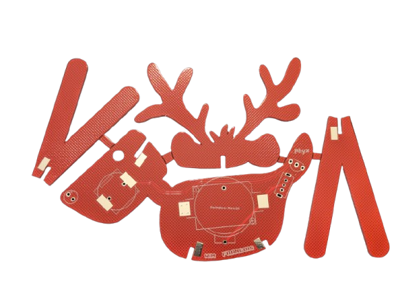

# REINDEER
Christmas themed solder kit in the shape of Rudolph the Red-Noosed reindeer

## Design
Together with Fraincois Janssens we designed this Holiday themed solder kit. The electronics are basic, just a blinking red LED, a CR2032 battery and a small switch. Once we finally get a hold  of the UM66T-01L "Jingle Bells" tone generator, we can start offering the more advanced version of the kit which adds a buzzer and said tone generator.

## REV 00
Revision 00 was a dry run test for the mechanical fit and component placement.

## REV 01 
The production revision is 01 and has solder pads to fix the legs and antlers.

## Assembly instructions
- carefully depanelize the PCB by bending the parts, use pliers to remove the small pieces connecting the PCBs together
- optionally file or sand the rough edges
- pay attention to the orientation of the battery holder and the LED
- bend the LED leads and solder it in place
- once all parts are soldered, do a dry fit of the parts to ensure proper installation
- soldering the mechanical joints on one side first will allow you to make easy corrections when it's not perfectly perpendicular